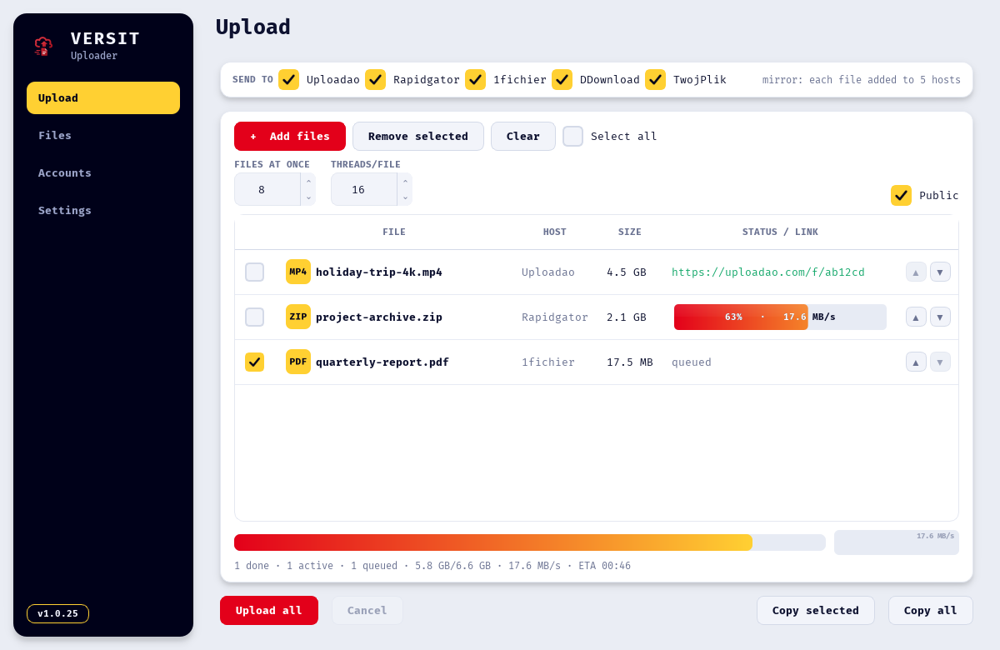
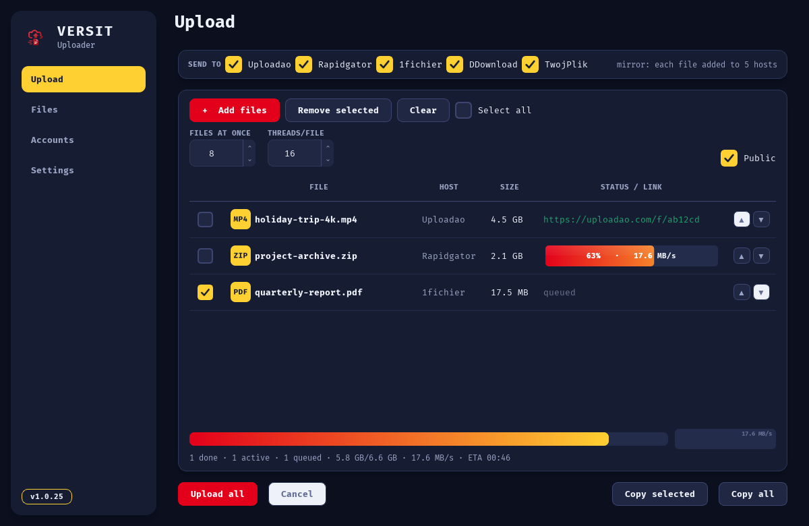
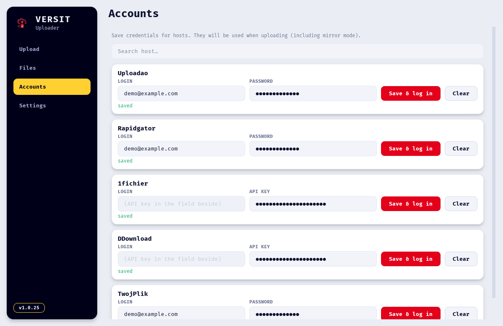
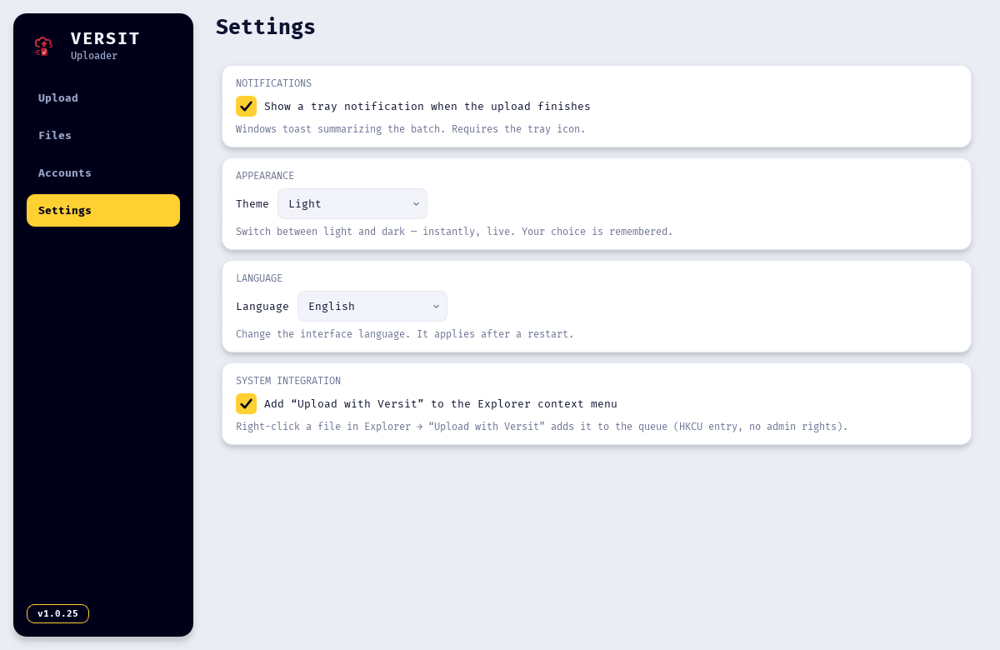

# Versit Uploader

A fast, no-friction desktop uploader for file-hosting services. Drop files in, get shareable links out. Built for large files and bulk uploads, with a queue, live ETA, account manager, and one-click mirroring across multiple hosts.

Windows desktop application, distributed as a single self-contained `.exe` with built-in auto-updates.

---

## Screenshots

Light & dark themes, a multi-host upload queue with per-file progress, an account manager with search, and a PL/EN interface.

<p align="center">
  
</p>

<p align="center">
  
  &nbsp;
  
</p>

<p align="center">
  
</p>

---

## Highlights

- **Multi-host** — upload to [Uploadao](https://uploadao.com), [Rapidgator](https://rapidgator.net), [1fichier](https://1fichier.com), [DDownload](https://ddownload.com), [Uploady](https://uploady.io), and [TwojPlik](https://twojplik.to) from one app.
- **Mirror** — send the same file to several hosts at once and get a link from each. Just tick the hosts under *Send to*.
- **Account Manager** — a dedicated tab to save and verify your credentials per host. Only configured hosts appear as upload targets.
- **Built for big files** — fully streamed uploads keep memory usage flat (a few MB of RAM) whether the file is 5 MB or 60 GB.
- **Upload queue** — add many files; send them one after another or several at once. Files added mid-upload are picked up automatically.
- **Parallel uploads** — send multiple files simultaneously (configurable, 1–8).
- **Multi-threaded per file** — on Uploadao, each file is split into parallel chunks to saturate your connection.
- **Reorder on the fly** — change upload order with the ▲▼ arrows or a right-click menu, even while uploading.
- **Live progress** — per-row status plus an aggregate bar with combined speed and ETA for the whole batch.
- **Resilient** — automatic retry with backoff on dropped connections, so a momentary network blip doesn't fail an entire file.
- **Resume-friendly state** — your queue, resulting links, settings, and saved accounts persist between sessions.
- **Drag & drop** — drop files straight onto the window.
- **Auto-update** — checks for new versions on launch and updates itself in place.

---

## Download

Grab the latest `VersitUploader.exe` from the [**Releases**](https://github.com/sitek-wy/versit-uploader/releases/latest) page.

No installer, no dependencies — just run the `.exe`. Windows 10/11, 64-bit.

> On first launch SmartScreen may warn about an unrecognized publisher (the build is unsigned). Choose **More info → Run anyway**.

---

## Usage

### 1. Add your accounts (Accounts tab)

Open the **Konta / Accounts** tab and fill in the hosts you want to use:

- **Uploadao / Rapidgator** — login + password.
- **1fichier / DDownload** — paste your **API key** into the key field (login is ignored).

Click **Save & log in** — the app verifies the credentials immediately (green ✓ on success). Saved accounts are remembered between sessions.

### 2. Upload (Upload tab)

1. Under **Send to**, tick the host(s) you want. Only hosts you've configured appear here. Tick more than one to **mirror** the upload.
2. **Add files** — click *Add files* or drag them onto the window. Each file becomes one row per selected host.
3. **Tune throughput** (optional):
   - **Files at once** — how many files upload simultaneously (1–8).
   - **Threads/file** — parallel connections per file (Uploadao).
4. Click **Upload all**.

### 3. Manage the queue

- **Checkbox** on each row — select rows for bulk actions (*Remove selected*, *Copy selected*).
- **▲▼ arrows** or **right-click menu** — move a row up/down, open or copy its link, or remove it. Reordering affects what uploads next.
- **Double-click a row** — open its link in the browser.
- **Copy all** — copy every finished link to the clipboard.

The queue and links persist after you close the app.

---

## Supported hosts

| Host | Auth | Upload model | Notes |
|------|------|--------------|-------|
| **Uploadao** | Optional (account or anonymous) | Multi-threaded chunked | Parallel chunks per file; fastest option |
| **Rapidgator** | Account (login + password) | Single streamed connection | Free accounts limited to 5 GB/file |
| **1fichier** | API key | Single streamed connection | Paste the API key into the key field |
| **DDownload** | API key | Single streamed connection | Paste the API key into the key field |
| **Uploady** | API key | Single streamed connection | Paste the API key into the key field |
| **TwojPlik** | Account (login + password) | Single streamed connection | — |

All uploads are streamed from disk, so even multi-GB files use only a few MB of RAM.

---

## Settings & data

The app stores its state in:

```
%APPDATA%\VersitUploader\config.json
```

This includes per-host credentials (passwords/keys are base64-encoded, **not** strongly encrypted), your last-used settings (files-at-once, threads, selected hosts), and the saved queue with its links.

To reset everything, delete that folder.

---

## Auto-update

On launch the app checks for the latest version. If a newer one exists, it offers to download and install it, then relaunches automatically. No manual download needed.

---

## Security & privacy

- Credentials are stored locally only. Passwords and API keys are base64-encoded in `config.json` — this is obfuscation, not encryption. Save accounts only on machines you trust.
- All transfers go directly to the chosen host over HTTPS. The app sends nothing to any third party.
- Treat your upload links as shareable URLs — anyone with the link can access a public file.

---

## License

Released for personal use. Not affiliated with any of the supported hosts.
