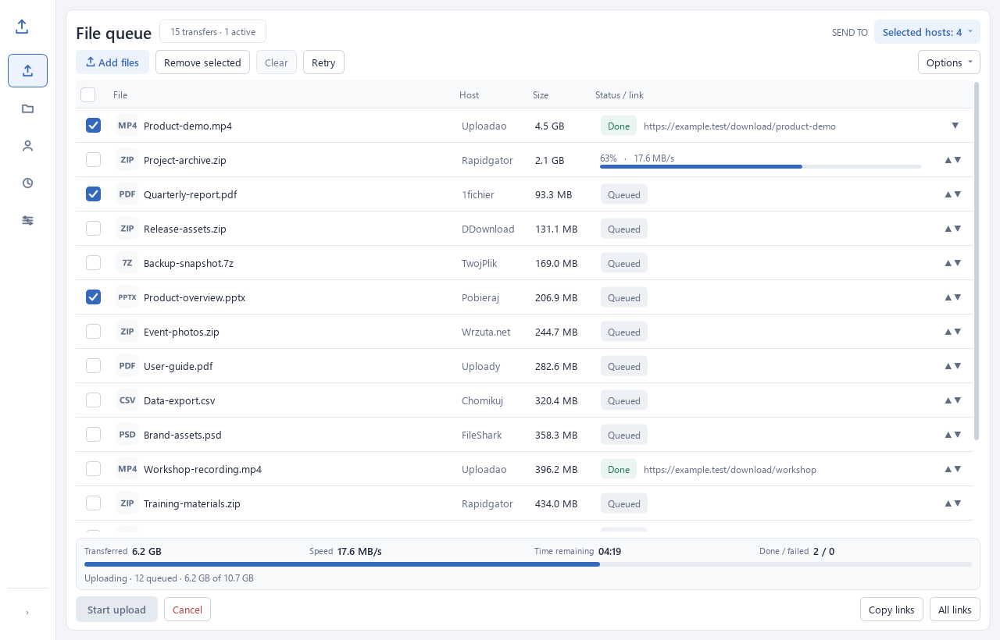
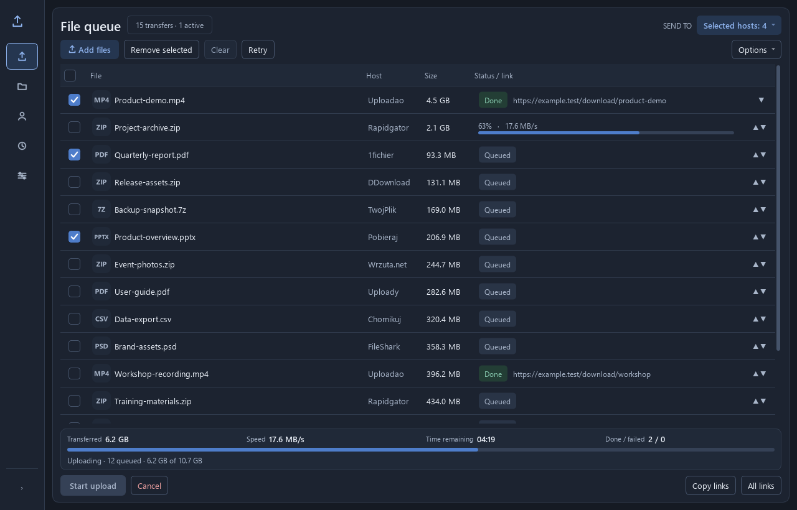
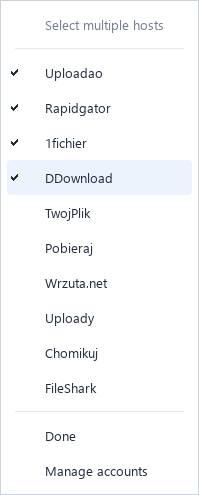
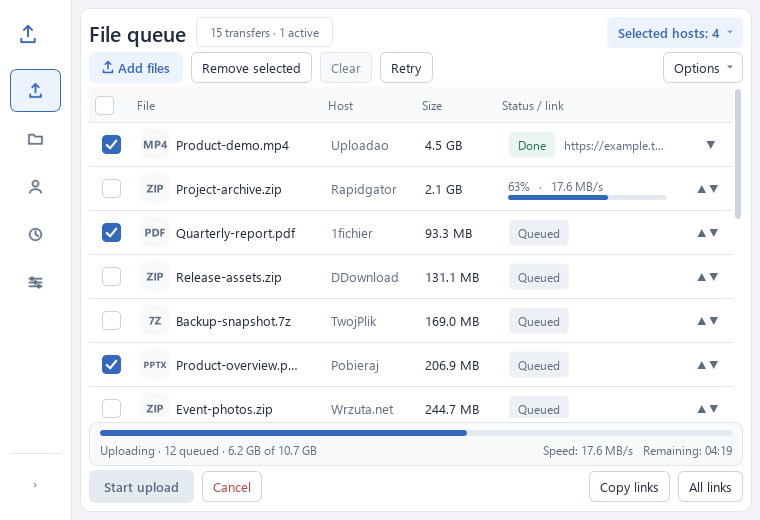
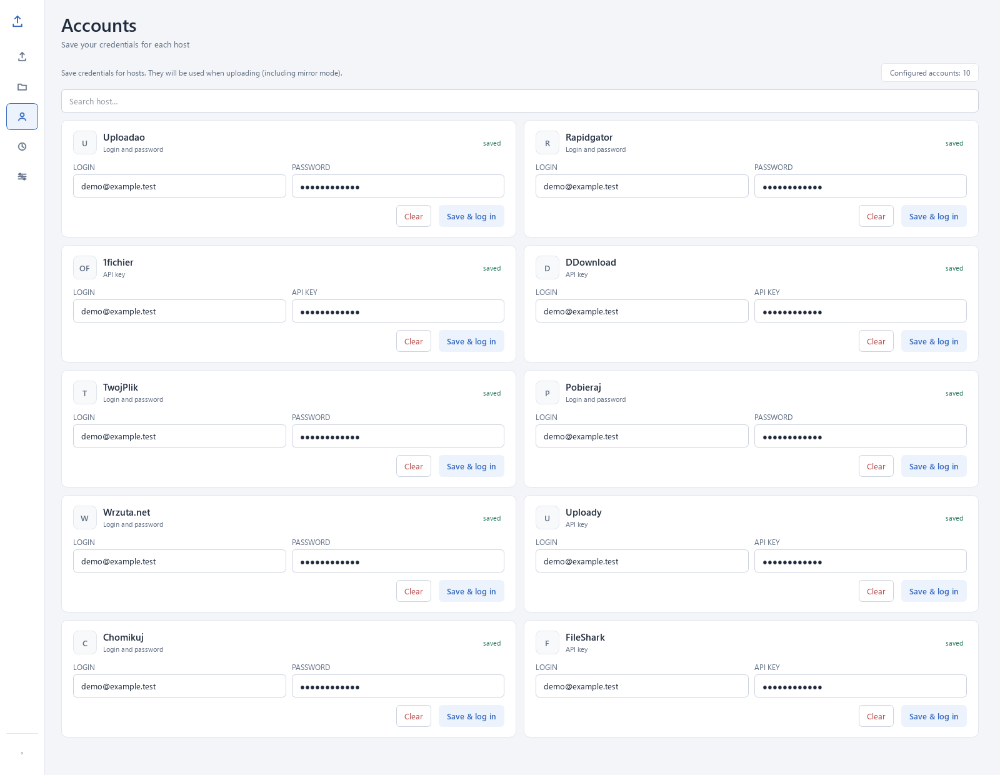
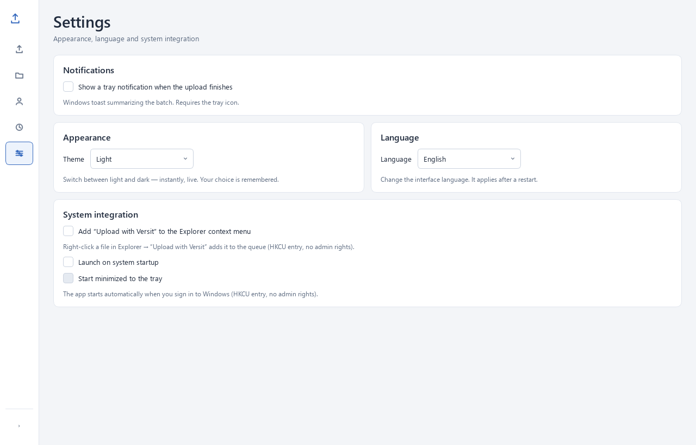

# Versit Uploader

**One queue. Ten hosts. Ready-to-share links.**

A Windows desktop uploader for large files and bulk transfers. Choose several destinations, drop in your files, and follow every upload in one spacious queue. Copy the finished links when you're done.

[**Download for Windows**](https://github.com/sitek-wy/versit-uploader/releases/latest) · [Supported hosts](#supported-hosts) · [Quick start](#quick-start)

Windows 10/11, 64-bit · Standalone `.exe` · English and Polish · Light and dark themes

## Screenshots

The current interface gives the file queue most of the window. Destination selection stays open while you select several hosts, with a **Done** button to close it.

<p align="center">
  
</p>

<details>
<summary>Dark theme, destination selection and compact window</summary>

<p align="center">
  
</p>

<p align="center">
  
  &nbsp;
  
</p>

</details>

<details>
<summary>Accounts and settings</summary>

<p align="center">
  
</p>

<p align="center">
  
</p>

</details>

Screenshots use demonstration files, accounts and transfer states.

## Supported hosts

All **10 hosts** are available in the account manager. Hosts with saved credentials appear in **Send to / Wyślij na**.

| Host | Credentials | Upload behavior |
|---|---|---|
| [Uploadao](https://uploadao.com) | Login + password | Parallel streamed chunks; saves incomplete uploads for restart resume |
| [Rapidgator](https://rapidgator.net) | Login + password | Streamed upload with hashing and server processing status |
| [1fichier](https://1fichier.com) | API key | Streamed multipart upload |
| [DDownload](https://ddownload.com) | API key | Streamed multipart upload |
| [TwojPlik](https://twojplik.to) | Login + password | Sequential streamed chunks using the ZOOM-compatible protocol |
| [Pobieraj](https://pobieraj.to) | Login + password | Sequential streamed chunks using the ZOOM-compatible protocol |
| [Wrzuta.net](https://wrzuta.net) | Login + password | 40 MiB chunks, duplicate checking and connection recovery during the upload |
| [Uploady](https://uploady.io) | API key | Streamed multipart upload |
| [Chomikuj](https://chomikuj.pl) | Login + password | ChomikBox-compatible upload to the account's root folder |
| [FileShark](https://fileshark.pl) | API key | Official API v1; streamed PUT parts and refreshed upload URLs on retry |

File-size limits and account restrictions depend on the hosting service. Files are read from disk as they upload, keeping file-data memory overhead low.

## What you can do

- **Mirror to several hosts:** select multiple destinations in one opening of the list. Each file gets its own transfer and link for each selected host.
- **Work with a large queue:** compact rows, collapsible navigation, per-file progress, combined speed and remaining time.
- **Control throughput:** 1–8 simultaneous transfers and 1–16 connections per file on Uploadao.
- **Add files your way:** drag and drop, **Add files**, the built-in **Files** browser, or optional Windows Explorer integration.
- **Manage transfers:** select rows, reorder pending work with the arrows or context menu, cancel, and use **Retry** for failed uploads. Files added during an upload are picked up automatically.
- **Keep your links:** copy selected or all finished links, and search the upload history by file, host or link.
- **Continue later:** accounts, settings, queue order and finished links persist between sessions. Uploadao also saves incomplete-upload state for restart resume.
- **Use Windows conveniences:** tray notifications, optional startup with Windows, and built-in update checks.

Automatic network retries are used where supported by the host adapter. Wrzuta.net and Chomikuj can recover server offsets during an upload; FileShark restarts as a new upload after cancellation or failure.

## Quick start

### 1. Download and open

Download `VersitUploader.exe` from [the latest release](https://github.com/sitek-wy/versit-uploader/releases/latest) and run it. No installer or separate Python installation is needed.

If Windows SmartScreen flags the unsigned build, choose **More info → Run anyway** after checking that you downloaded it from this repository.

### 2. Add your accounts

Open **Accounts / Konta**, enter your credentials, and choose **Save & log in / Zapisz i zaloguj**.

- **Login + password:** Uploadao, Rapidgator, TwojPlik, Pobieraj, Wrzuta.net and Chomikuj.
- **API key:** 1fichier, DDownload, Uploady and FileShark. Paste the key into **API key / Klucz API**.
- **FileShark:** generate your key in the account's security settings. Existing browser sessions need to be replaced with an API key.
- **Wrzuta.net:** the account is saved locally and verified when the first upload starts.

### 3. Choose destinations and files

1. Open **Transfers / Transfery** and the **Send to / Wyślij na** list.
2. Select one or several hosts. The list stays open between selections; close it with **Done / Gotowe**, Esc or a click outside it.
3. Choose **Add files / Dodaj pliki**, drag files onto the window, or add them from **Files / Pliki**. One file creates one queue row per selected host.
4. In **Options / Opcje**, optionally adjust **Simultaneous files** and **Connections per file**. The latter applies to Uploadao.
5. Choose **Start upload / Rozpocznij wysyłanie**.

Destination changes apply to files added afterward. Existing queue rows retain their host.

### 4. Manage the queue and links

- Use the row checkboxes for **Remove selected / Usuń zaznaczone** and **Copy links / Kopiuj linki**.
- Use **▲▼** or the right-click menu to change the pending upload order, retry a transfer, open or copy a link, or remove a row.
- Double-click a completed row to open its link.
- Choose **All links / Wszystkie linki** to copy every finished link.
- Use **History / Historia** to find previously uploaded files and their links.

## Settings and local data

The app stores accounts, preferences, the queue and history in:

```text
%APPDATA%\VersitUploader\config.json
```

Uploadao's incomplete-upload state is stored separately in `resume.json` in the same folder.

Passwords and API keys are base64-encoded rather than encrypted. Save credentials only on a computer you trust and keep this folder private.

Transfers go to the selected hosting service. Chomikuj authentication uses HTTPS; its legacy upload protocol may provide an HTTP endpoint for file data. Treat download links as shareable URLs: anyone with a public file's link may be able to access it.

The app checks GitHub Releases on launch and offers to download and install a newer version when one is available. **Settings / Ustawienia** controls the theme, language, notifications and optional Windows integration.

## License

Released for personal use. Not affiliated with any of the supported hosting services.
